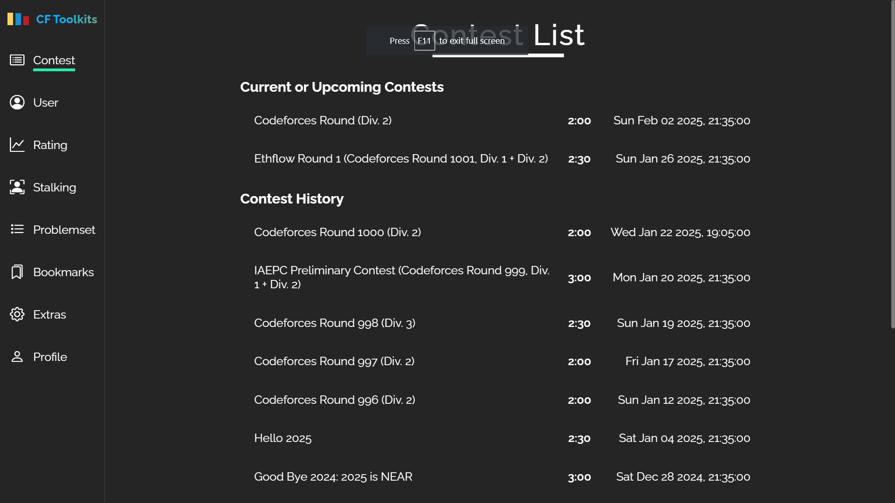
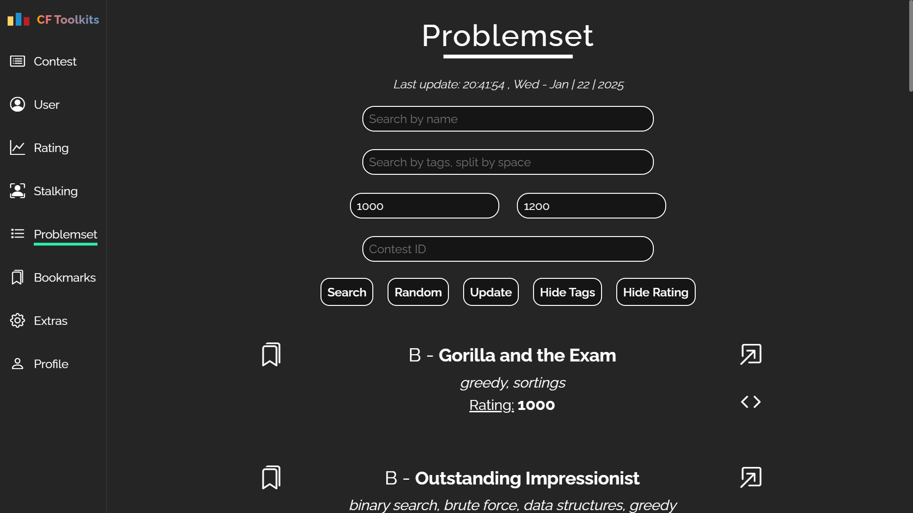
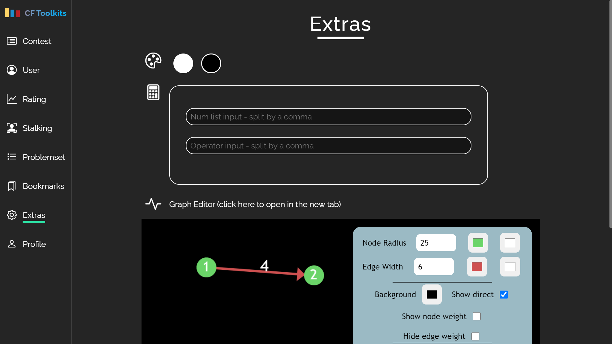

<h1 align="center">Codeforces Toolkit</h1>

<strong>A tool helps you working with Codeforces rapidly</strong>

  
  

  
  
  
  

<a href="https://yuran1811.github.io/Codeforces-Toolkit/" target="_blank">Live Demo</a>

## Features

- Search user's info by handle
- Search user's rating by handle
- Search user's status (problems solved) by handle
- Search problemset follow options
- Bookmark the problems and save them
- See current or upcoming + finished contests
- Draw the graph with vertexes and edges
- Graph Editor (integrated in CF Toolkit):
  - Add new node with weight
  - Add edge of two nodes and edges' weight (even edge of one node and its own)
  - Infinite space
  - Customize the node radius, edge width, nodes' color, node weight's color, edges' color, edge weight's color and background color
  - Show / Hide the direct of edges
  - Draw the graph based on the test input
  - Copy the input data

## Screenshots

## References

- [Codeforces API](https://codeforces.com/apiHelp)
